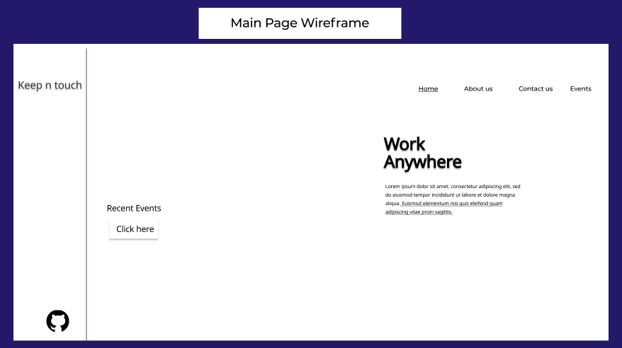

# Task One

### (Stage 1: Problem Domain & Requirements : Task 1.1)

## Problem Domain & Requirements:

In a parallel world there is a company called ASAC. This company works in the field of developing and building websites. I and a group of my friends work in it as a group of professionals in website development. We were recently asked to develop a project that is a website that allows the following user: First, a flexible home page. Secondly, the shopping cart allows the user to purchase event tickets and enables him to view his purchases. Third, the company asked us to create a page about developers (ie, our group). Fourth page allows the user to provide feedback. And finally, create a sidebar on the main page that contains several information.

### (Stage 1: Project Risks : Task 1.2)

## Risks:

The areas of risk related to the successful completion of our project are several: First, time management, we had to divide the time in the best possible way, and that's we did. Secondly, the code conflict, since we are a group while working on the same code, there was a conflict when uploading it to the GitHub platform, but we overcame that. Thirdly, change the website wireframe. Finally, the opinion of stakeholders, it is normal for one to change his opinion, so we have been in contact with them to avoid this risk.

### (Stage 1: Examine : Task 1.3)

## List of requirements:

* Flexible home page that contains a button that diverts the user to a set of events and is provided with details about those events.

* A page containing all the available events that can be shown to the user for reservations.

* The function on the shopping cart page allows the user to purchase event tickets, cancel the purchase order according to his desire, and enable him to view his purchases.

* The company asked us to create a page where information about the developers (ie our group) who developed this site are displayed.

* A page that allows the user to provide feedback or add suggestions about the performance of the site.

* The sidebar on the homepage includes the company name and a link to our group's GitHub page.

## Database design and the Wireframes:

### Database:

### Wireframes:

## Activity Diagram:

## Coding and implementation technique:

### We used Agile

Agile is a methodology in the software development process by which software is created and developed through collaborative efforts within a self-organised, cross-functional team.

These principles advocate adaptive planning, incremental evolution, early delivery, and continuous improvement, and encourage rapid and flexible response to change. These principles underpin the definition and continued evolution of many methodologies/software development approaches

It is also one of the best ways to develop software by applying it and helping others to do so. Considering:

* Individuals and their interaction with each other above systems and tools.
* Usable software above full documentation.
* Customer cooperation and participation above contract negotiation.
* Responding to changes above and beyond commitment to a specific action plan.

## Testing technique:

1. Black box testing: The external website design and structure, button features and add to the cart button, as an example, have been tested
2. White box testing: To ensure that there are no mistakes, we have tested an internal structure source code of the site.

# Task Two

### (Stage 1: Project Design : Task 2.1)

## Visual Studio Code:
is a small but powerful code editor that runs on Windows,MacOS and Linux on your desktop. It features built-in JavaScript, TypeScript and Node.js support, plus a wide range of additional language extensions (such as C++, C#, Java, Python, PHP, GO) and runtimes (such as .NET and Unity).

## PyCharm: 
The software produced by the Czech JetBrains company offers code analysis, graphical error detector, a built-in unit test tool, audit control system integration, support for web development in Django, and data science applications in Anaconda. Paycharm is a program that may be cross-platform; Linux, Mac OS and Windows can operate with it.

## Linux:
is an operating system, as are Windows, iOS and Mac OS. Indeed, the Linux operating system operates one of the most popular platforms in the world, Android. The OS is a program that handles all your desktop or laptop hardware resources. Simply explained, the operating system handles your software and hardware connections. The software would not work without the operating system (OS).

## Windows:
is a group of software known as an OS that operates a machine (personal computer). It was first developed by Microsoft in November 1985, and was often modified as the computer memory grew, the chips became quicker and, indeed, the internet invented. PCs used a number of text commands before Windows. Enables the user to engage with the machine (through the keyboard, mouse, microphone, etc.). Checks the data storage (images, files, music). Hardware controls connected to the computer, including cameras, scanners and printing systems.

## GitHub:
is a version management and collaborative code hosting website. It enables you and others to work collaboratively from anywhere on projects. You'll establish your own Hello World repository and discover GitHub's Pull Request procedure, a popular way to develop and evaluate code.

## GitLab:
is a single application, the open DevOps platform. This makes GitLab unique and offers a simplified software workflow which releases your company from a compound toolchain's restrictions. Learn how GitLab delivers unparalleled insight and greater productivity throughout the DevOps life cycle in a single application.

## Comparison Between Visual Studio Code and PyCharm:

| IDE      | Visual Studio Code | PyCharm     |
|    :----:   |    :----:   |     :----:    |
|    Performance   |    Visual Studio Code is a winner, but it will not function very well. Visual Studio Code is a lightweight IDE that is very high. Visual Studio Code is highly dependent on extensions and additional features, and the projects or other libraries are not loaded unless the developers load them.   |     PyCharm contains various backend modules and services required for loading in order to launch the IDE. On average, a very sluggish load time has been recorded for PyCharm.    |
|    Extensions   |    For every framework / platform/language, Visual Studio Code is a modular IDE that may be turned into a complete IDE.   |     PyCharm is a specialized solution for Python developers and you might require additional IDEs such as IntelliJ for Java to download and create.    |
|    Debugging   |    VSCode lets you execute and go through your code in debug mode. On the left side, the variables, the values, the call stack and the breakpoints are shown in the local and global pane. Float over a variable to see its current context value. Also accessible are all normal execution checks, step over, step out. VSCode also allows you to build conditional interruptions that are helpful to search for a certain problem-causing data condition.   |     PyCharm has the same characteristics as VSCode and the debug settings are shown on the bottom pane. Variables and values can be seen, entered, exceeded and deleted.    |

## Comparison Between Linux and Windows:

| Operating System      | Linux | Windows     |
|    :----:   |    :----:   |     :----:    |
|    Access   |    With Linux, the user has access to the kernel source code and changes it to suit his or her needs. It has its own advantages, such as OS faults repair quickly; and downsides such as OS weaknesses may be exploited by developers if they find them.   |     Each user does not have access to the source code in windows; only members of the group chosen have access to the source code.    |
|    Usability   |    The installation of Linux is difficult yet it is easy to do sophisticated tasks.   |     Windows gives user’s a simple system to operate, but it will take a longer time to install.    |
|    Command-line   |    The command line is a highly important tool in Linux for administration and everyday activities but does not make much difference for end-users.   |     We have a command line on Windows, however we cannot utilize a command line with Linux. We need to execute the cmd to open the command line.    |

## Comparison Between GitHub and GitLab:

| Version-control platform      | GitHub | GitLab     |
|    :----:   |    :----:   |     :----:    |
| Fees      | GitHub projects with publicly published codes are free and available to anyone.       | GitLab is a web developer repository that may collaborate on codes solely with its team.   |
| Location   | GitHub does not enable a repository to be located inside a free plan organization.        | GitLab enables its customers to find a repository within a company utilizing the free scheme.      |
| Issue Tracker   | The problem tracker allows requests to be pulled so that the issues that have been raised are immediately shutdown upon fusion.        | In this case, the problem tracker enables users to automatically close problems with PRs.      |

### But now, to work on my project I will choose these tools: Visual Studio Code (IDE), Linux (Operating System), and GitHub (Version-control platform).

------
------

### (Stage 1: Project Design : Task 2.2)

## After I finished presenting my unprecedented, powerful, fiery, scorching, scorching review, I will present now, yes, now, and I will provide a comprehensive explanation of the reasons for choosing the tools and techniques I chose to develop my application:

At first, my friend, I will tell you that the beginnings are always difficult, as I was confused between VS code and PyCharm, but in the end I chose VS code because it is a lightweight IDE that is very high. Visual Studio Code is highly dependent on extensions and additional features, and the projects or other libraries are not loaded unless the developers load them. Also among those extensions there is an extension called live server. This extension is based on Live my current server. This extension enables me to download live functionality for dynamic sites additionally Live Server - Makes my current server live - it helps me to reload live dynamic content feature on this web extension. As for the operating system, I chose Linux for several reasons, the most important of which is that I am more comfortable with it, as it is smooth and flexible for me. The other reasons are the command line, since a lot of Linux was originally created to run on servers, so I can navigate the system Entirely using the command line only. Where I also use its terminal to write in it the commands that help me to include my work on GitHub, which is what I will talk about now. I chose the GitHub because the projects with codes published in general are free and available to anyone, as I benefited and learned from other people on this platform Without any cost, which helped us access the repository of our project, me and my group, as we worked on all of them and modified them without any difficulties or Financial costs and quite easily, whatever the systems of our teamwork.

### (Stage 1: Relate the selected tools : Task 2.3)

## I will provide now, a comprehensive explanation of the reasons for choosing the tools and techniques I chose to develop my application:

First I'm going to inform my buddy that the beginnings are usually tough, as I'm puzzled between VS code and PyCharm, but I've chosen VS code at the end since it's a very lightweight IDE. Visual Studio Code depends heavily on extensions and other capabilities. Unless the developer loads the projects or other libraries. There is also an extension called a live server among these extensions. This addon is based on my existing server Live. This plugin allows me to download live features for dynamic websites Active server - Make my existing server live - it lets me refill my web extension with a live dynamic content capability. When it comes to operating systems, we chose Linux for several reasons, but the most important of which is familiarity with Linux because it is smooth and flexible. Another reason is the command line. Many Linux's were originally created to run on servers, allowing you to navigate the entire system using only the command line. It also describes commands that help you include working on GitHub using the terminal. This will be explained later. We chose GitHub because the project where the code is public is free and anyone can use it. I was able to access the repositories within the project and in my group because I learned free benefits from others on this platform. Whatever the system of teamwork, we changed them very easily, without coping with all of them, and without incurring financial costs.

### (Stage 2: Project Implementation : Power Point presentation: 1)

Power Point presentation in BTEC word and in BTEC file.

### (Stage 2: Project Implementation : Develop our Application: 2)

[GitHub](https://github.com/KEEP-N-TOUCH/KEEP-N-TOUCH) & [Keep-N-Touch](https://keep-n-touch.github.io/KEEP-N-TOUCH/)

### (Stage 2: Project Implementation : Feedback: 3)

### 1. Home Page Design:

" Add a background on the home page and add animation. "

### 2. Page/Function of the card:

" We have solved this problem by creating the card page so that the user can see his purchases. "

### 3. Header, font type and size must be the same on all pages:

" We solved it by putting the same type, font size, and header on all pages. "

### Improvements:

" The card page and put the same type, font size and header on all pages "

### Not improvements:

" Slide show & video Background & Cart checkout "

### (Stage 3: Project Evaluation : Assess the performance: 1)

I find that the website is easy to use and that people appreciate the style and method we show the pets and options that we have made for the user after it, and that the menu is a bar that guides the user finishing anywhere he wishes.
On the shopping cart page, the events that the user has booked for purchase are displayed but we do not have the checkout feature so we need to add this function to improve the quality of the site also we need to add the slide show on the home page to better display the events to the user. The rest of it works just as well as we expected.

### (Stage 3: Project Evaluation : The key factors that can negatively impact in our project: 2)

We changed the plan several times to solve this problem. We developed a limited server for each page and worked on it as well as the conflict. We solved this problem through the instructions that we learned in this course and applied them step by step. Finally, we encountered several problems in several areas while writing the code for the project and we solved it By hiring teachers and searching on Google.

Testing: 

1. Black box testing: The external website design and structure, button features and add to the cart button, as an example, have been tested
2. White box testing: To ensure that there are no mistakes, we have tested an internal structure source code of the site.

### (Stage 3: Project Evaluation : Strengths & Weaknesses: 3)

Strengths:
1. Local storage is used to store user information.
2. It's stable and simple to utilize our website.
3. The user may operate our cart from a table to ensure that the user is not confused.

Weaknesses:
1. There is no login page for us.
2. Not ready cart checkout.
3. A lot of animations we haven't used.

## References:

1. https://content.techgig.com/pycharm-vs-visual-studio-code-which-one-to-choose-for-python-development/articleshow/75388084.cms

2. https://www.computerhope.com/jargon/w/windows.htm

3. https://about.gitlab.com/what-is-gitlab/